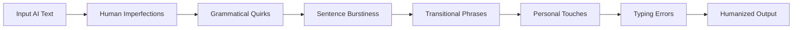

<div align="center">


# ⚡ StudyForge — AI Text Humanizer

**Humanize AI-generated text. Bypass detection. Stay undetectable.**

[](https://github.com/heshanflash/AI-Text-Generator/stargazers)
[](LICENSE)
[](https://heshanflash.github.io/AI-Text-Generator/)
[](https://developer.mozilla.org/en-US/docs/Web/HTML)
[](https://developer.mozilla.org/en-US/docs/Web/CSS)
[](https://developer.mozilla.org/en-US/docs/Web/JavaScript)

</div>

---

## 📖 Table of Contents

- [Overview](#-overview)
- [Live Demo](#-live-demo)
- [Features](#-features)
- [How It Works](#-how-it-works)
- [Humanization Pipeline](#-humanization-pipeline)
- [Getting Started](#-getting-started)
- [Usage Guide](#-usage-guide)
- [Customization](#-customization)
- [Technology Stack](#-technology-stack)
- [Project Structure](#-project-structure)
- [Browser Support](#-browser-support)
- [Contributing](#-contributing)
- [License](#-license)
- [Acknowledgments](#-acknowledgments)

---

## 🌟 Overview

**StudyForge** is a powerful, client-side AI text humanizer that transforms robotic, AI-generated text into natural, human-like writing. Built with zero dependencies and fully offline-capable, it applies multiple layers of linguistic transformations to make text indistinguishable from human-written content.

Whether you're a student, content creator, or professional — StudyForge helps your AI-assisted writing pass through undetected.

---

## 🔗 Live Demo

> **Try it now:** [https://heshanflash.github.io/AI-Text-Generator/](https://heshanflash.github.io/AI-Text-Generator/)

No installation. No sign-up. No data leaves your browser. Just paste, click, and get humanized text instantly.

---

## ✨ Features

<table>
<tr>
<td width="50%">

### Core Capabilities
- 🔄 **Multi-pass Humanization Pipeline** — Applies 6 sequential transformation layers
- 🎚️ **Adjustable Intensity** — Slider from 0% (subtle) to 100% (extreme)
- 🖥️ **Live Typewriter Output** — Watch your text morph in real-time
- 📋 **One-click Copy** — Copy to clipboard instantly
- 📥 **Download as TXT** — Save output as a `.txt` file
- 🔂 **Improve Further** — Run additional passes to increase humanization
- 📊 **Word & Character Count** — Track your output metrics

</td>
<td width="50%">

### Humanization Layers
- ✏️ **Human Imperfections** — Replaces robotic phrases with natural alternatives
- 💬 **Grammatical Quirks** — Injects conversational starters ("Anyway,", "So,", "Honestly,")
- 📏 **Sentence Burstiness** — Varies sentence length with short interjections
- 🙋 **Personal Touches** — Adds anecdotes and personal observations
- 🔗 **Transitional Phrases** — Seeds natural connectors between sentences
- ⚠️ **Typing Errors** — Simulates occasional capitalization mistakes & double spaces

</td>
</tr>
</table>

### All toggleable individually — mix and match layers to your preference.

---

## 🧠 How It Works

StudyForge doesn't use any AI or machine learning — it's a deterministic (with controlled randomness) rule-based transformation engine that mimics how humans actually write.

### The Problem with AI Text:
- **Overly formal** — "utilize", "in order to", "due to the fact that"
- **Uniform sentence length** — Every sentence is the same size
- **Perfect grammar** — No quirks, no personality, no voice
- **Zero transitions** — Paragraphs jump between ideas abruptly
- **Impersonal tone** — No anecdotes, no first-person perspective

### The StudyForge Solution:
Each transformation layer targets a specific "tell" of AI-generated text and replaces it with human-like patterns. The result: text that reads like a real person wrote it.

---

## 🔬 Humanization Pipeline



### Layer Details

| # | Layer | What It Does | Example |
|---|-------|-------------|---------|
| 1 | **Human Imperfections** | Replaces robotic academic phrases with natural equivalents | `"utilize"` → `"use"`, `"in order to"` → `"to"` |
| 2 | **Grammatical Quirks** | Prepends sentences with conversational starters | `"Anyway, the results..."`, `"So, what we found..."` |
| 3 | **Sentence Burstiness** | Intersperses short punchy sentences | `"Simple as that."`, `"Right?"`, `"You get it."` |
| 4 | **Transitional Phrases** | Adds natural connectors between ideas | `"Moreover,"`, `"That said,"`, `"To be honest,"` |
| 5 | **Personal Touches** | Injects personal anecdotes into paragraphs | `"I've seen this happen more times than I can count."` |
| 6 | **Typing Errors** | Simulates human typing mistakes | Occasional missing capitals, double spaces |

### Intensity Levels

| Level | Range | Best For |
|-------|-------|----------|
| **Subtle** | 0–30% | Light cleanup, keep most original structure |
| **Normal** | 30–70% | Balanced humanization for most use cases |
| **Extreme** | 70–100% | Aggressive rewording, max undetectability |

---

## 🚀 Getting Started

### Option 1: Live Website (Recommended)

Visit **[heshanflash.github.io/AI-Text-Generator](https://heshanflash.github.io/AI-Text-Generator/)** — works instantly in your browser.

### Option 2: Run Locally

```bash
# Clone the repository
git clone https://github.com/heshanflash/AI-Text-Generator.git

# Navigate into the folder
cd AI-Text-Generator

# Open in your default browser
open index.html
```

Or just double-click `index.html` after cloning. No server, no build tools, no npm install — it just works.

---

## 📘 Usage Guide

### Basic Flow

1. **Paste** your AI-generated text into the input area
2. **Toggle** the humanization controls you want active
3. **Adjust** the intensity slider to your desired level
4. **Click "⚡ Humanize Text"**
5. **Watch** the output appear with a typewriter animation
6. **Copy** or **Download** the result

### Advanced Tips

- **Start subtle** — Low intensity (20-30%) preserves your original meaning while cleaning robotic patterns
- **Layer selectively** — Turn off "Typing Errors" for formal documents, turn it on for casual writing
- **Use "Improve Further"** — Runs another pass at +20% intensity for text that still feels robotic
- **Iterate** — Export, re-paste, and re-humanize with different settings for maximum disguise

---

## ⚙️ Customization

All configuration lives in `script.js` — no build step, no config files:

```javascript
Humanizer.config = {
  enabled: true,       // Master on/off
  quirks: true,        // Grammatical quirks
  burstiness: true,    // Sentence length variation
  personal: true,      // Personal anecdotes
  transitions: true,   // Transitional phrases
  errors: true,        // Typing simulation
  intensity: 0.5       // 0.0 to 1.0
};
```

### Adding Custom Replacements

Edit the `imperfections` array in `script.js` to add your own phrase replacements:

```javascript
const imperfections = [
  { pattern: /\byour phrase\b/gi, replacement: 'better phrase' },
  // Add more patterns here
];
```

---

## 💻 Technology Stack

| Technology | Purpose |
|-----------|---------|
|  | Semantic structure & accessibility |
|  | Dark-themed UI with CSS Grid & CSS Variables |
|  | Humanization engine & UI interactivity |
|  | Zero-config hosting & deployment |

**Zero dependencies.** No frameworks. No build tools. No npm. Pure vanilla web standards.

---

## 📁 Project Structure

```
AI-Text-Generator/
├── index.html          # Main application HTML
├── styles.css          # Dark theme stylesheets
├── script.js           # Humanization engine + UI logic
├── README.md           # You are here
└── .gitignore          # Git ignore rules
```

---

## 🌐 Browser Support

| Browser | Support |
|---------|---------|
| Chrome | ✅ Full support |
| Firefox | ✅ Full support |
| Safari | ✅ Full support |
| Edge | ✅ Full support |
| Opera | ✅ Full support |
| Mobile browsers | ✅ Fully responsive |

---

## 🤝 Contributing

Contributions are welcome! Here's how:

1. **Fork** the repository
2. **Create** a feature branch: `git checkout -b feature/amazing-feature`
3. **Commit** your changes: `git commit -m 'Add amazing feature'`
4. **Push** to the branch: `git push origin feature/amazing-feature`
5. **Open** a Pull Request

### Ideas for Contributions
- Additional humanization layers
- Multi-language support
- AI detector score comparison
- Dark/Light theme toggle
- Export as PDF/Word
- Browser extension

---

## 📄 License

This project is licensed under the MIT License — see the [LICENSE](LICENSE) file for details.

---

## 🙏 Acknowledgments

- Inspired by the need for undetectable AI-assisted writing
- Built with pure vanilla web technologies — no frameworks needed
- Fonts by [Google Fonts](https://fonts.google.com/) (Inter)

---

<div align="center">

### ⭐ Star this repo if you find it useful!

Made with 💙 by [heshanflash](https://github.com/heshanflash)

[⬆ Back to Top](#-studyforge--ai-text-humanizer)

</div>
